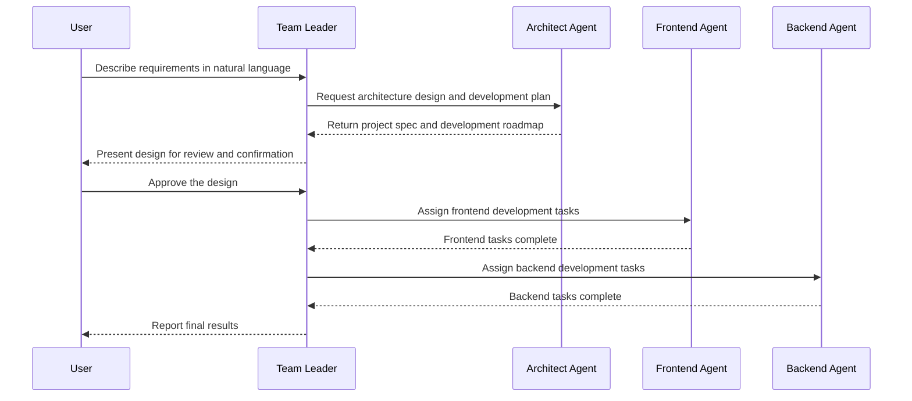

# Welcome to EasyCoda

Welcome to [EasyCoda](https://easycoda.com)! AI coding platform that enables users to build applications through natural language.

https://github.com/user-attachments/assets/30e087a6-47b1-4f09-8e99-7d775a8f2f75

## What is EasyCoda?

EasyCoda is a revolutionary AI-powered programming platform that lets you create full-stack applications using natural language. Whether you're a complete beginner or a seasoned developer, EasyCoda helps you bring your ideas to life faster and more efficiently.

We believe that "not knowing how to code" should never stand between anyone and their ideas. Whether you're an entrepreneur, a designer, a product manager, or simply someone with a brilliant concept, you deserve a complete software development team — on call, ready to execute.

That's why we built a development team composed of AI agents: an Architect overseeing the big picture, a Frontend Engineer focused on the interface, a Backend Engineer handling the logic, and a Team Leader keeping everything on track. What traditional software companies might take months and millions of dollars to deliver, EasyCoda can help you build step by step — something real, deployable, and continuously improvable.

This isn't a toy for generating throwaway web pages. This is engineering-grade delivery capability.

You bring the idea. We'll make it real.

## How Does EasyCoda Work?

EasyCoda provides intelligent agent teams for many common programming languages and frameworks — including Angular, React, and Vue for frontend development, and Java, Go, Node.js, and Python for backend development. Each agent team includes a **Team Leader**, an **Architect Agent**, and either a **Frontend Agent** or a **Backend Agent** (or both). Simply describe what you need in plain language, and your agent team will turn that vision into reality. For more details, see the [Agent Teams Guide](https://docs.easycoda.com/en/guides/agent-teams).

### Re-entrant Design

EasyCoda is built with a re-entrant architecture that supports unattended operation. You don't have to sit at your computer waiting for development to finish. Once you've discussed your requirements with the **Team Leader**, the **Architect Agent** generates a development specification — covering tech stack choices, scope, and boundaries — for your review and approval. After that, the **Team Leader** coordinates the rest of the team to write the code while you focus on what matters most to you. Come back whenever it's convenient to check on progress. You can also enable project notifications so you'll receive an email or SMS when development is complete.

### Sandbox Environment

EasyCoda provides every agent team with a ready-to-use cloud sandbox environment that is secure, fast to spin up, and lightweight. Each application running in the sandbox gets a secure, isolated access URL. Security has always been a core priority — it's woven into every stage of our product design and implementation. Because everything runs in the cloud, there's nothing to download or install locally, and you never have to worry about local file exposure or personal data leaks. You can access your agent development team from any device, at any time — 24/7, always on call. For more details, see the [Sandbox Guide](https://docs.easycoda.com/en/guides/dev-sandbox).

### Core Features

- 📝 **Natural Language Programming** — Build the software you want by simply chatting with AI in plain language.
- 🤖 **AI Agent Team Collaboration** — A coordinated team of AI agents delivers maintainable architecture and production-ready code.
- 🔧 **Full-Stack Development** — Supports multiple languages and frameworks for end-to-end application development.
- 🔄 **Re-entrant Design** — Unattended autonomous development mode; check in on progress whenever it suits you.
- ⚡ **Instant Preview** — Watch your code come to life in real time. No waiting, no compiling, no manual deploys.
- 🔁 **Iterative Refinement** — Just say what you'd like to change. Adjust layouts, colors, and features through natural conversation.
- 🔒 **Privacy Protection** — Nothing to download, nothing to install locally. Build securely in the cloud with end-to-end encrypted workflows.
- 📈 **Zero Learning Curve** — No complex frameworks or syntax to learn. Focus on your idea, not on how to implement and ship it.
- 👥 **Team Collaboration** — Multiple people can collaborate and watch AI agents complete tasks together in real time.
- 📦 **Version Control** — Every completed feature is automatically pushed to a version control repository, with full rollback support.
- 🚀 **Effortless Deployment** — Download your project at any time and deploy it freely to any platform you prefer.
- 💻 **Online Code Editor** — Edit code directly in the browser, debug issues, and work alongside your AI agents to get things done.

### Resources

- [Documentation](https://docs.easycoda.com)
- [EasyCoda](https://easycoda.com)
- [EasyCoda Console](http://easycoda.com/console/new)

