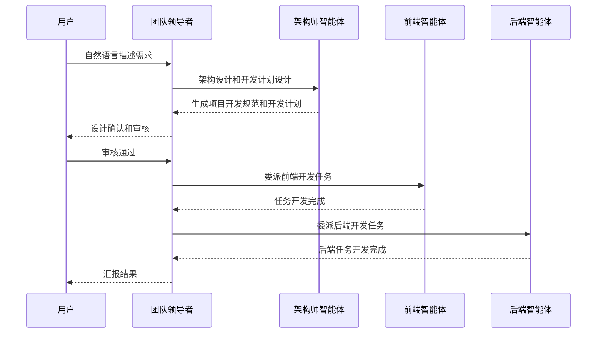

# 欢迎使用 EasyCoda

欢迎来到 EasyCoda！本指南将帮助您了解 EasyCoda，并快速上手开发自己的应用软件。

## 什么是 EasyCoda？

EasyCoda 是一个革命性的 AI 驱动编程平台，让您能够使用自然语言轻松创建全栈应用程序。无论您是编程新手还是资深开发者，EasyCoda 都能帮助您更快、更高效地实现您的创意。

我们相信，"不会写代码"不应该成为任何人实现想法的障碍。无论你是创业者、设计师、产品经理，还是脑子里有个绝妙念头的普通人，你都值得拥有一支完整的软件开发团队——随时待命，听你调遣。

所以我们构建了一个由 AI 智能体组成的开发团队：有负责全局的架构师，有专注界面的前端工程师，有处理逻辑的后端工程师，有把控方向的团队领导者。传统软件公司需要数月和数百万预算才能交付的产品，EasyCoda 可以陪你一步步做出来——真实可用，可以落地，可以持续迭代。

这不是"生成个网页玩玩"的玩具。这是工程级别的交付能力。

你有想法，我们来实现。

## EasyCoda 如何工作？

EasyCoda 提供多种常见编程语言和框架的智能体团队，有前端应用开发的 Angular，React 和 Vue 智能体团队，也有后端应用开发的 Java，Go，Nodejs 和 Python 等智能体团队，每种智能体团队包含**团队领导者（Team Leader）**，**架构师（Architect Agent）智能体** 和 **前端智能体（Frontend Agent）** 或者 **后端智能体（Backend Agent）** 等角色。您只需要用自然语言描述您的需求，您的智能体团队会将您的想法变为现实。更多智能体详情参考 [智能体指南](/zh/guides/agent-teams)。

### 可重入设计

EasyCoda 采用可重入设计实现，支持无人值守模式。您不必一直守在电脑跟前等待智能体的项目开发完成，当您和**团队领导者智能体**沟通完需求之后，**架构师智能体**会为您生成开发规范，包含项目技术选型，开发边界等，待您审核通过之后，**团队领导者智能体** 会为您协调其他智能体实现代码，此时，您可以专注于您的其他更重要工作，待您时间方便的时候您可以在再次开项目查看开发进度。或者您也可以设置项目通知，然后去休息，等项目开发完成之后您会收到智能体给您发来的项目完成邮件或者短信通知。

### 沙盒环境

EasyCoda 为每个一个智能体团队提供了一个开箱即用的云端的沙盒环境，该沙盒环境具有安全，快速启动，轻量等特点。并且为运行在沙盒中的应用提供安全隔离的访问地址。对于运行在互联网上的沙盒环境，安全一直是我们重点关注的方向，也一直贯穿于我们整个产品的设计和实现过程中。得益于云端的工作模式，您不必下载安装任何软件到您的电脑上，不必担心本地文件，私人信息的泄露，充分保障您的隐私安全。您可以在任何时间，任何设备上访问您的智能体开发团队，7x24，随时听您调遣。更多沙盒详情查看 [沙盒指南](/zh/guides/dev-sandbox)

### 核心特性

- 📝 **自然语言编程**：通过使用自然语言和 AI 聊天的方式构建您想要的软件。
- 🤖 **AI 智能体团队协作**：AI 智能体团队协作开发，交付可维护的项目设计和代码。
- 🔧 **全栈开发能力**：支持多种开发语言和框架，支持开发全栈应用。
- 🔄 **可重入设计**：无人值守自主开发模式，您可以随时随地查看开发进度。
- ⚡ **即时渲染**：实时看到您的代码变为现实。无需等待、编译或部署。即时视觉反馈。
- 🔁 **迭代优化**：说出您想要更改的内容。通过自然对话调整布局、颜色和功能。
- 🔒 **隐私保护**：无需下载，无需本地安装。通过端到端加密的工作流程，在云端安全构建应用程序。
- 📈 **零学习曲线**：无需学习复杂的框架或语法。专注于您的想法，而非实现和交付方式。
- 👥 **团队协作**：支持多人协作，同时在线观看 AI 智能体完成任务。
- 📦 **版本管理**：每一功能实现都会自动推送至版本管理仓库，您可以随时回滚指定版本。
- 🚀 **轻松部署**：您可以自由下载您开发的软件，自由部署至您喜欢的任何平台。
- 💻 **在线代码编辑**：您可以在线手动编辑代码，调试问题，和 AI 智能体一起完成任务。

